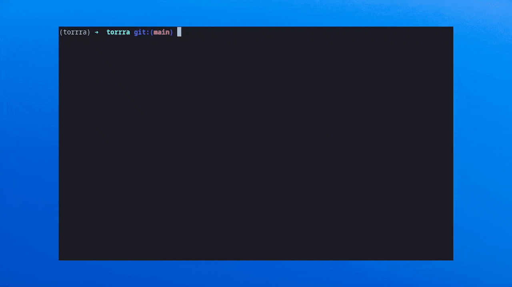

# Torrra - “rrr”

> A Python tool that lets you find and download torrents without leaving your CLI.

[](https://pypi.org/project/torrra/)
[](https://pypi.org/project/torrra/)
[](https://aur.archlinux.org/packages/torrra)
[](https://pypi.org/project/torrra/)
[](https://torrra.readthedocs.io/)
[](https://github.com/stabldev/torrra/blob/main/LICENSE)
[](https://github.com/stabldev/torrra/issues)
[](https://github.com/stabldev/torrra/issues)



*Torrra* provides a streamlined command-line interface for torrent search and downloads, powered by Jackett/Prowlarr and Libtorrent. Built with Textual, it offers a beautiful TUI with pause/resume support - all without leaving your terminal.

**Full documentation**: https://torrra.readthedocs.io/en/latest/

## Installation

```bash
pipx install torrra
```

Other options: [AUR](https://aur.archlinux.org/packages/torrra), [standalone binaries](https://github.com/stabldev/torrra/releases), or [Docker](https://hub.docker.com/r/stabldev/torrra).

[See full install options →](https://torrra.readthedocs.io/en/latest/installation.html)

## Quick Usage

```bash
torrra jackett --url http://localhost:9117 --api-key <your_api_key>
```

Then use the arrow keys to navigate, `Enter` to download, `p` to pause, `r` to resume, `q` to quit.

[See full CLI & TUI guide →](https://torrra.readthedocs.io/en/latest/usage.html)

## Features

- Search with [`Jackett`](https://github.com/Jackett/Jackett) or [`Prowlarr`](https://github.com/Prowlarr/Prowlarr)
- Download torrents with [`Libtorrent`](https://libtorrent.org)
- Full-screen TUI with pause/resume
- Smart config + opt-in caching
- Native support for Linux/macOS/Windows

[Full feature list →](https://torrra.readthedocs.io/en/latest/#features)

## Contributing

Found a bug? Want to help?  
Check out [Contributing](https://torrra.readthedocs.io/en/latest/contributing.html) or [open an issue](https://github.com/stabldev/torrra/issues).

## License

[MIT](https://github.com/stabldev/torrra/blob/main/LICENSE) Copyright (c) [stabldev](https://github.com/stabldev)
